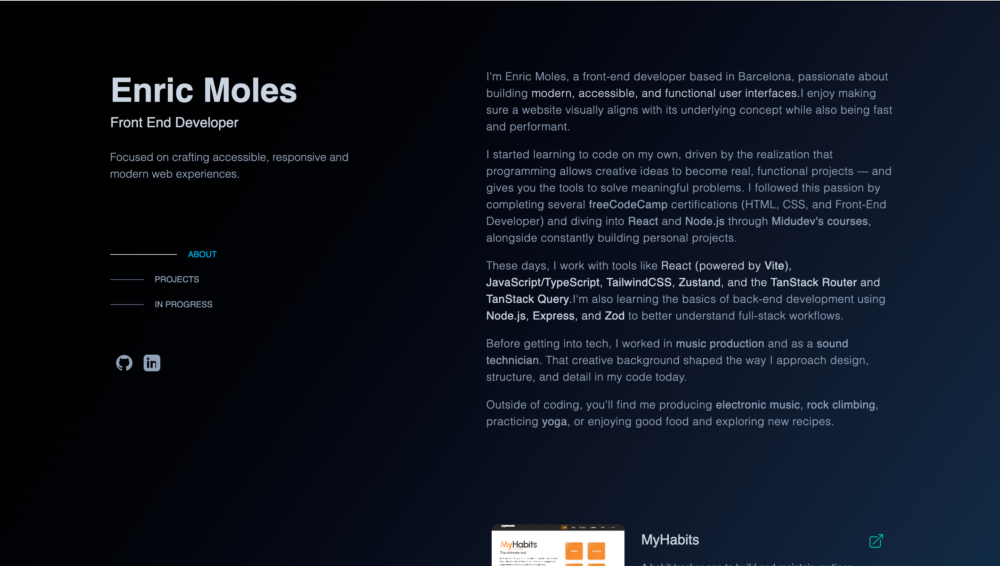
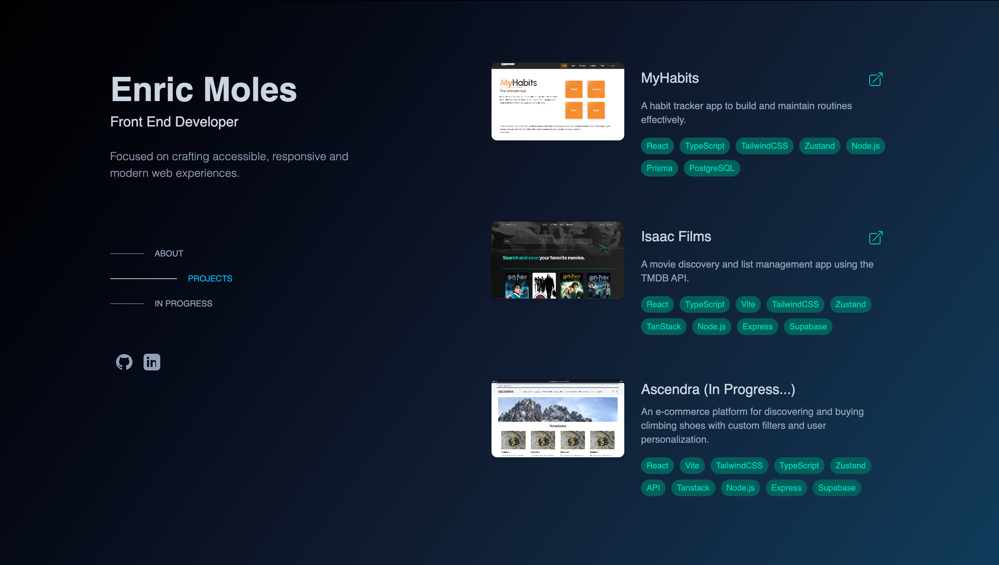
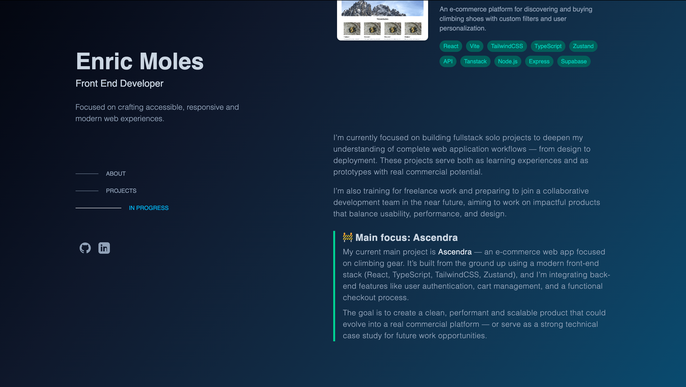
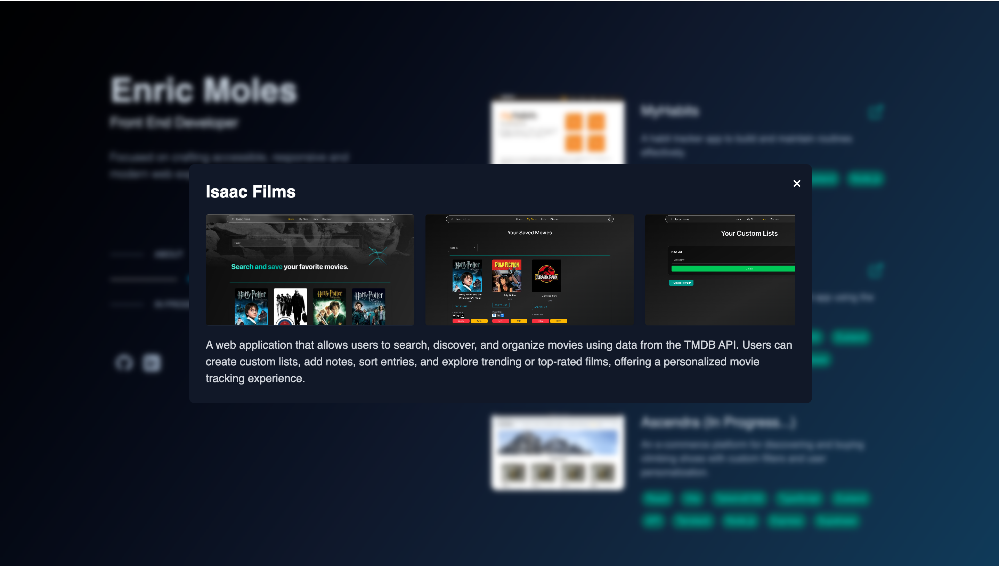
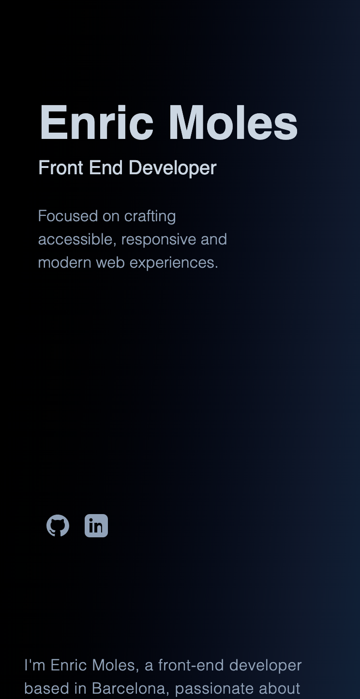
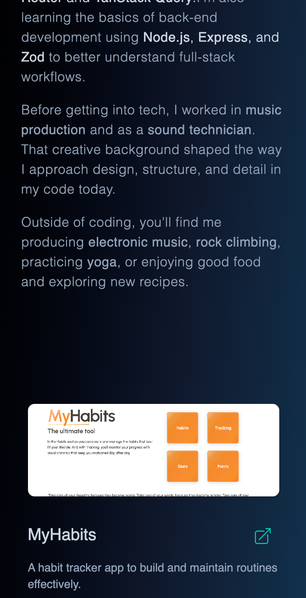

# 💼 Enric Moles — Portfolio

A clean and minimal developer portfolio inspired by [Brittany Chiang](https://brittanychiang.com/).  
This site showcases my web development work, highlights what I’m currently building, and gives a brief overview of who I am.

---

## ✨ Features

- 🖼️ Interactive project gallery with screenshots, details, and external links
- 🔗 Smooth scrolling with active section highlighting
- 📱 Fully responsive and accessible layout
- 🔍 Modal viewer for project images

---

## 🛠️ Tech Stack

- ⚛️ [React](https://react.dev/) + [Vite](https://vitejs.dev/)
- 💨 [Tailwind CSS](https://tailwindcss.com/) for utility-first styling
- 📁 Data-driven project rendering from a JSON list

---

## 📸 Screenshots

> Preview of the portfolio website:

---

## 🌐 Live Demo

👉 [enricmoles.dev](https://enricmoles.dev)  
*(Replace with actual live link if needed)*

---

## 👤 Author

**Enric Moles**

- 🔗 GitHub: [@AprenentEMB](https://github.com/AprenentEMB)  
- 💼 LinkedIn: [Enric Moles](https://www.linkedin.com/in/enric-moles-bellveh%C3%AD-7358b024a/)  
- 📧 Email: [enricmoles94@email.com](mailto:enricmoles94@email.com)

---

## 📄 License

This project is open-source under the [MIT License](./LICENSE).

